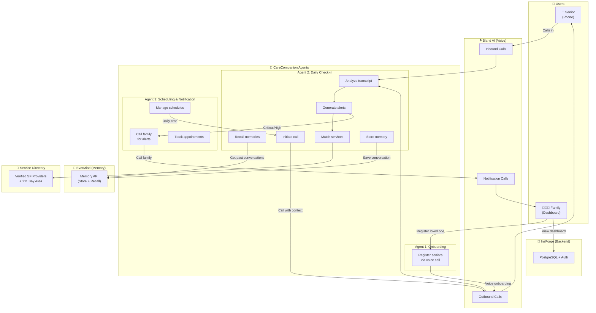
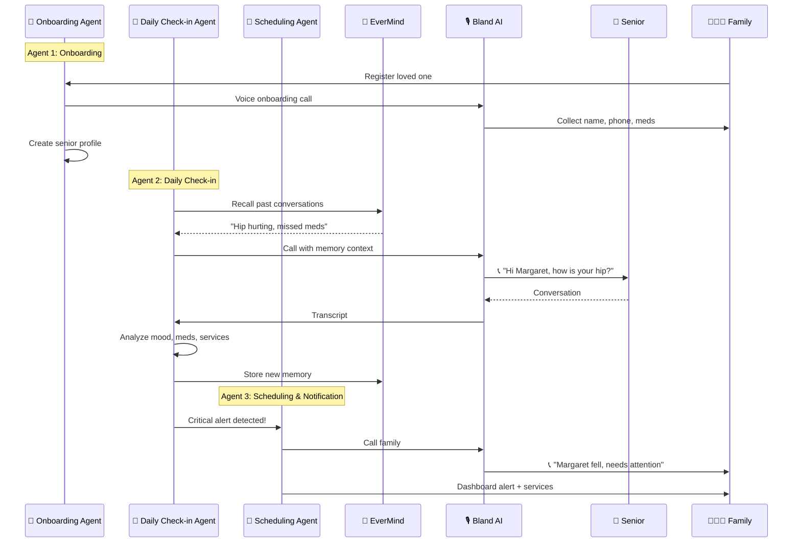

# CareCompanion

Voice-first AI senior care companion. Daily automated phone check-ins keep seniors safe and families informed — plus on-demand service requests for food, medicine, bathing, mail, transportation, and emergencies.

## Architecture — 3-Agent System



## How It Works

1. **Bland AI** calls your loved one daily for a friendly check-in
2. Covers: mood, medications, and any needs or concerns
3. **EverMind** remembers past conversations — AI follows up on previous concerns
4. Detects service needs: "I need help showering", "I'm hungry", "I need my medicine"
5. **Alerts** fire automatically — family sees them on the dashboard with recommended local services
6. **InsForge** powers the backend infrastructure

## Agent Flow



## Tech Stack

| Tool | Role |
|------|------|
| **Bland AI** | Voice agent — conducts check-in phone calls |
| **EverMind** | Persistent memory — AI remembers past conversations |
| **InsForge** | Backend infrastructure (Postgres, auth, storage) |
| **FastAPI** | Python backend API |
| **Chart.js** | Wellness trend visualization |

## Quick Start

```bash
# Install dependencies
uv sync

# Start EverMind (optional — for persistent memory)
cd ../EverMemOS && docker-compose up -d
PYTHONPATH=src uv run python src/run.py &

# Configure CareCompanion
# Edit .env with BLAND_AI_API_KEY and BASE_URL (ngrok)

# Start server
uv run python main.py

# Start ngrok (for Bland AI webhooks)
ngrok http 8000

# Seed demo data
uv run python scripts/seed_data.py
```

## Service Categories

| Service | Detection | SF Providers |
|---------|-----------|--------------|
| 🚿 Shower/Bath | "shower", "help bathing" | Home Instead, Visiting Angels |
| 💊 Medicine | "prescription", "refill" | Alto Pharmacy, Walgreens, CVS |
| 🍽️ Food/Meals | "hungry", "can't cook" | Meals on Wheels SF, Project Open Hand |
| 📬 Mail | "check my mail", "package" | USPS Carrier Pickup |
| 🚗 Transportation | "need a ride", "doctor" | SF Paratransit, GoGoGrandparent |
| 🚑 Emergency | "fell", "chest pain", "911" | 911, UCSF Medical, SF General |
| 💛 Companionship | "lonely", "no one visits" | Institute on Aging Friendship Line |

## API Endpoints

### Seniors
- `POST /api/seniors` — Add a senior
- `GET /api/seniors` — List all
- `POST /api/checkins/trigger/{phone}` — Trigger a call

### Alerts & Services
- `GET /api/alerts` — Active alerts
- `GET /api/services` — Service directory
- `GET /api/services/211` — 211 Bay Area info

### Webhooks
- `POST /api/webhooks/bland/call-complete` — Bland AI outbound callback
- `POST /api/webhooks/bland/inbound-complete` — Inbound call callback

## Project Structure

```
CareCompanion/
├── main.py                          # FastAPI app entry point
├── app/
│   ├── config.py                    # Settings from .env
│   ├── database.py                  # In-memory data store
│   ├── auth.py                      # Auth dependency
│   ├── models/                      # Pydantic models
│   │   ├── senior.py                #   Senior profile
│   │   ├── checkin.py               #   Check-in + service requests
│   │   └── alert.py                 #   Alert with severity levels
│   ├── routers/                     # API endpoints
│   │   ├── seniors.py               #   CRUD for seniors
│   │   ├── checkins.py              #   Check-in history + trigger calls
│   │   ├── alerts.py                #   Alert listing + acknowledge
│   │   ├── webhooks.py              #   Bland AI webhook processing
│   │   └── services.py              #   Service directory + 211 + Google Places
│   └── services/                    # Business logic
│       ├── bland_ai.py              #   Voice call integration + prompts
│       ├── call_analyzer.py         #   NLP transcript analysis (7 categories)
│       ├── alert_engine.py          #   Rule-based alert generation
│       ├── memory.py                #   EverMind memory integration
│       ├── scheduler.py             #   APScheduler daily cron
│       ├── service_directory.py     #   Verified SF providers + 211 + Google Places
│       └── inbound.py               #   Inbound call agent config
├── frontend/                        # Family dashboard
│   ├── index.html                   #   Sidebar layout + pages
│   ├── style.css                    #   Responsive styles
│   └── app.js                       #   Dashboard logic + auto-refresh
├── scripts/
│   └── seed_data.py                 #   Demo data seeder
└── docs/
    └── architecture.html            #   Interactive architecture diagrams
```

## Interactive Architecture Diagrams

Open [docs/architecture.html](docs/architecture.html) in a browser for detailed interactive diagrams including:
- High-level system architecture with all components
- Call flow with memory sequence diagram
- Data model (ER diagram)
- Service request detection flow
